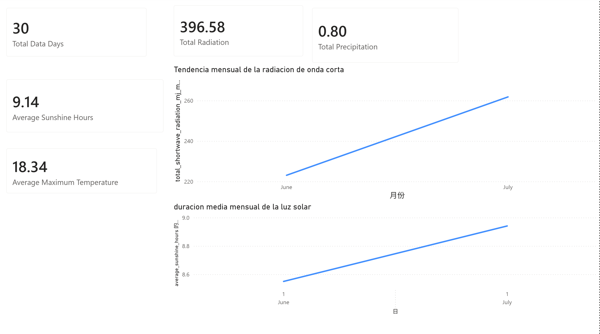
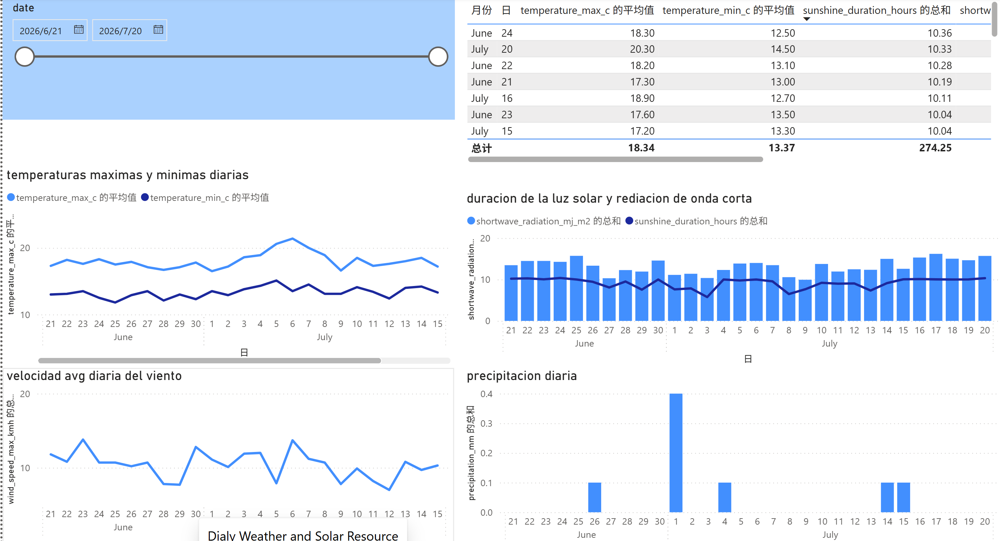
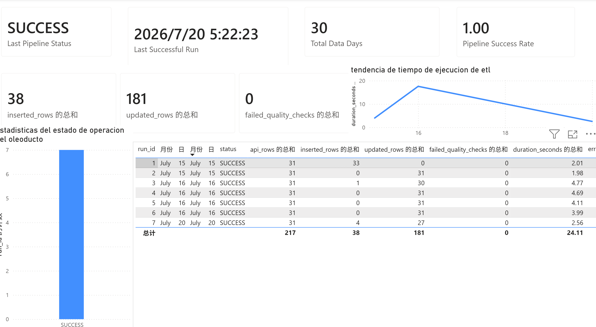

# Antofagasta Solar Weather ETL & Power BI Dashboard

A data analytics portfolio project focused on solar resource monitoring and weather conditions in Antofagasta, Chile.

This project extracts weather and solar radiation data from the Open-Meteo API, processes and validates the data with Python and pandas, stores historical records in MySQL, creates SQL analytical views, and presents the results through a Power BI dashboard.

## Project Objective

The goal of this project is to build a small but complete data analytics workflow:

- Extract weather and solar radiation data from an external API.
- Clean and transform the data using Python and pandas.
- Store historical records in a MySQL database.
- Create SQL views for analytical use.
- Build a Power BI dashboard for solar and weather monitoring.

## Tech Stack

- Python
- pandas
- requests
- MySQL
- SQL
- SQLAlchemy
- PyMySQL
- Power BI
- Excel
- GitHub

## Data Source

The project uses daily weather and solar radiation data from the Open-Meteo API.

Current scope:

- Location: Antofagasta, Chile
- Data frequency: Daily
- Analysis window: Approximately 30 days
- Main indicators:
  - Solar radiation
  - Sunshine duration
  - Maximum temperature
  - Minimum temperature
  - Precipitation
  - Wind speed

## Data Pipeline

Open-Meteo API  
→ Python data extraction  
→ pandas cleaning and transformation  
→ Data quality checks  
→ MySQL historical storage  
→ SQL analytical views  
→ CSV / Excel export  
→ Power BI dashboard  

## Key Features

- API data extraction using Python.
- Data cleaning and transformation with pandas.
- MySQL database storage for historical weather records.
- UPSERT logic to avoid duplicate city-date records.
- Transaction handling and rollback on failure.
- Pipeline execution logging.
- Data quality checks for null values, duplicates, numeric ranges, and invalid values.
- SQL views for daily, monthly, and recent-period analysis.
- Power BI dashboard with solar resource, weather, and pipeline health pages.

## Power BI Dashboard

The Power BI dashboard provides a visual summary of solar resources, weather conditions, and pipeline reliability.

### 1. Executive Overview

This page provides a high-level summary of the main solar and weather indicators, including total data days, solar radiation, precipitation, sunshine duration, and temperature.

### 2. Daily Weather & Solar Analysis

This page provides a detailed daily view of solar radiation, sunshine duration, temperature, and related weather indicators.

### 3. Pipeline Health

This page monitors ETL pipeline execution, data freshness, data quality, and successful pipeline runs.

## Power BI Report File

The complete Power BI report file is available here:

[Download the Power BI report (.pbix)](dashboard/Antofagasta_Solar_Weather_Dashboard.pbix)

## Repository Structure

- dashboard/
  - Antofagasta_Solar_Weather_Dashboard.pbix
  - executive_overview.png
  - daily_weather_solar_analysis.png
  - pipeline_health.png

- src/
  - config.py
  - database.py
  - health_check.py
  - main.py
  - runtime_lock.py

- sql/
  - schema.sql
  - views.sql
  - analysis_queries.sql

- scripts/
  - run_pipeline.ps1
  - check_pipeline_health.ps1
  - install_scheduled_task.ps1
  - remove_scheduled_task.ps1

- tests/
  - test_pipeline.py

- docs/
  - architecture.md
  - power_bi_data_dictionary.md
  - power_bi_build_guide.md
  - power_bi_automation_guide.md
  - troubleshooting.md

## Main SQL Objects

The MySQL layer includes:

- weather_daily: Historical daily weather and solar radiation table.
- pipeline_runs: Pipeline execution audit table.
- vw_weather_daily: Clean daily analytical view.
- vw_monthly_solar_summary: Monthly summary view.
- vw_recent_30_days: Recent 30-day monitoring view.

## Data Quality Checks

The pipeline includes validation checks for:

- Missing city values
- Missing date values
- Duplicate city-date records
- Invalid date format
- Non-numeric values
- Invalid temperature ranges
- Invalid sunshine duration
- Negative radiation values
- Negative precipitation values
- Negative wind speed values

## How to Run the Project

1. Install dependencies:

py -m pip install -r requirements.txt

2. Create the environment file:

Copy-Item .env.example .env

3. Update `.env` with your local MySQL credentials.

4. Run the ETL pipeline:

py -m src.main

5. Run the health check:

.\scripts\check_pipeline_health.ps1

## Power BI Connection

Power BI connects to the MySQL analytical views.

Recommended views:

- vw_weather_daily
- vw_monthly_solar_summary
- vw_recent_30_days

The data dictionary is available in:

docs/power_bi_data_dictionary.md

## Current Limitations

- The current version only analyzes Antofagasta, Chile.
- The dashboard uses a short historical window, not a long-term climate dataset.
- The project does not include forecasting or machine learning models.
- The Power BI dashboard is designed for portfolio demonstration, not production deployment.
- MySQL and Power BI Service gateway configuration must be handled manually.

## What I Learned

This project helped me practice:

- Building an end-to-end ETL workflow.
- Working with external API data.
- Cleaning and validating daily weather records.
- Designing MySQL tables and analytical SQL views.
- Connecting structured data to Power BI.
- Building a portfolio dashboard for renewable energy analytics.

## Author

Yi Peng Luo Huang

Junior Data Analyst | SQL | Power BI | Python | Retail Operations | Renewable Energy
